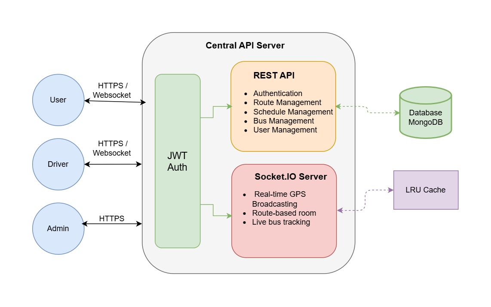
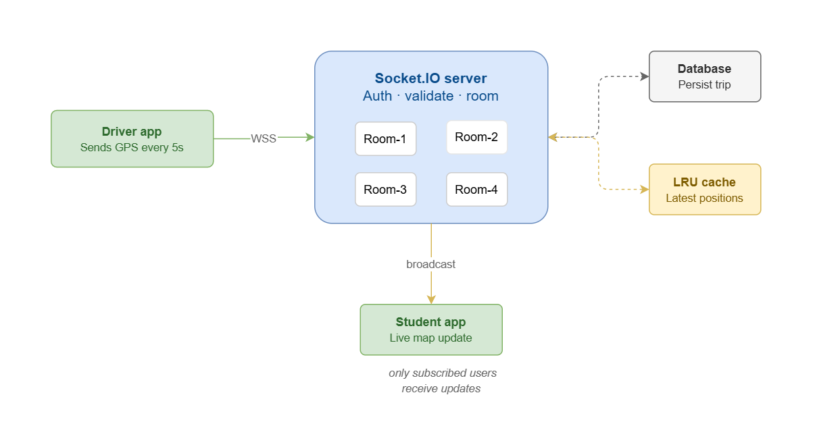
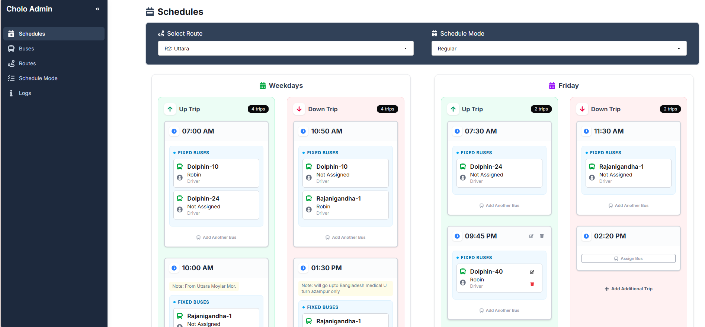
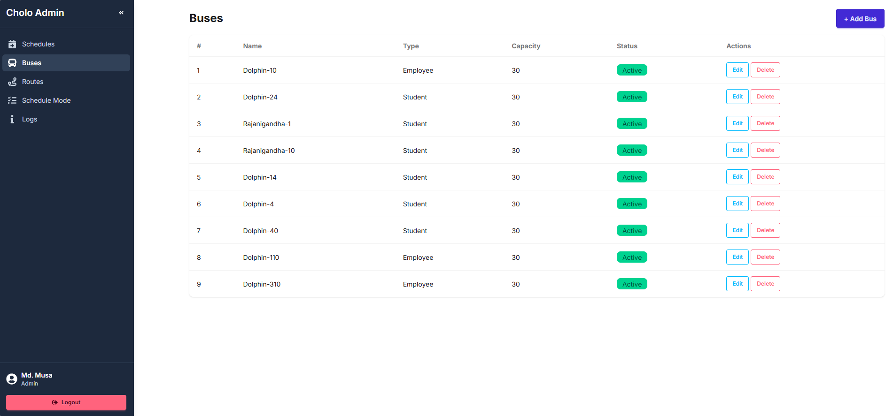
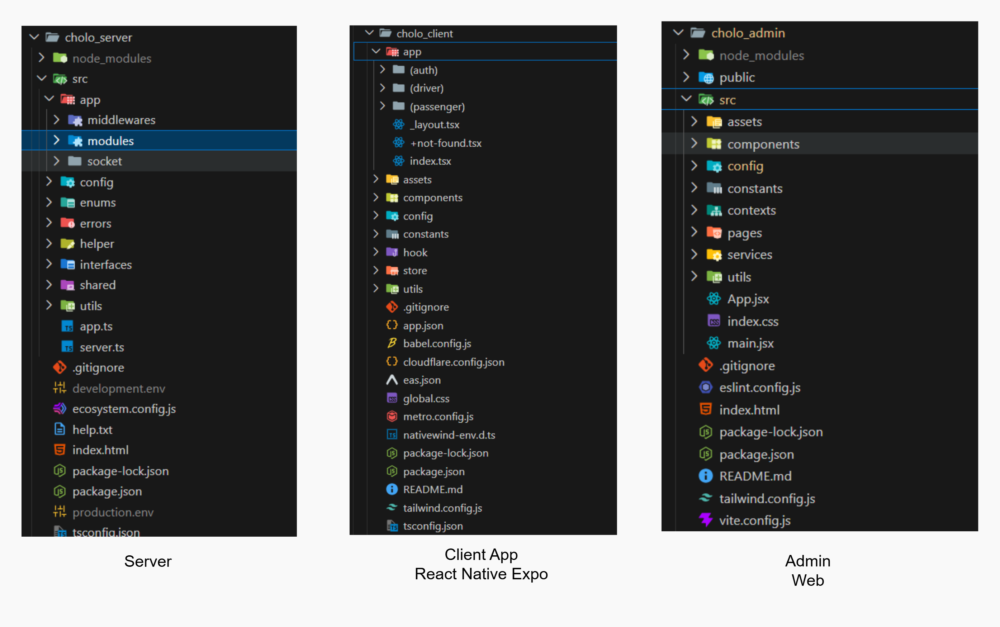

<div align="center">
  

  <h1>CholoDIU</h1>

  <p>Real-Time University Transport Tracking System</p>

  <a href="https://play.google.com/store/apps/details?id=com.musa.cholo">
    
  </a>

  <br />

  > **Test credentials** &nbsp;|&nbsp; Email: `test.user@diu.edu.bd` &nbsp;&nbsp; Password: `111111`

</div>

## Table of Contents

1. [Overview](#1-overview)
2. [Features](#2-features)
3. [Tech Stack](#3-tech-stack)
4. [System Architecture](#4-system-architecture)
5. [Real-Time Tracking Flow](#5-real-time-tracking-flow)
6. [Database Collections](#6-database-collections)
7. [Screenshots](#7-screenshots)
8. [Project Structure](#8-project-structure)
9. [Installation & Setup](#9-installation--setup)
10. [API Reference](#10-api-reference)
11. [Deployment](#11-deployment)
12. [Challenges](#12-challenges)
13. [Engineering Highlights](#13-engineering-highlights)
14. [Future Improvements](#14-future-improvements)

## 1. Overview

CholoDIU is a real-time university transport management system built to solve a real problem at Daffodil International University—students had no easy way to know where buses were, whether a trip had started, or how long they needed to wait.

The system allows students to view schedules, check assigned buses, and track live bus locations with ETA and distance directly from their phones. Drivers use the same app to start trips and broadcast their GPS location every 5 seconds. All updates are delivered in real time using Socket.IO.

The project consists of a React Native mobile app for students and drivers, a React admin dashboard, and an Express.js backend. It is live on the Google Play Store with 1000+ downloads and is actively used by students at the university.

## 2. Features

| #   | Feature               | Description                                              |
| --- | --------------------- | -------------------------------------------------------- |
| 1   | **Live Bus Tracking** | Real-time GPS updates via Socket.IO every 5 seconds      |
| 2   | **ETA & Distance**    | Calculated using Turf.js and the Haversine formula       |
| 3   | **Route-Based Rooms** | Users receive updates only for their selected route      |
| 4   | **Assigned Bus View** | Students can view the bus assigned to their route        |
| 5   | **Driver Broadcast**  | Drivers share live location during active trips          |
| 6   | **Schedule Viewing**  | Students can view bus schedules from the mobile app      |
| 7   | **Map View**          | Live moving markers and route polylines with MapLibre    |
| 8   | **Sign In / Sign Up** | Secure onboarding for students, drivers, and admins      |
| 9   | **Authentication**    | JWT access and refresh tokens with role-based middleware |
| 10  | **Role System**       | Separate roles for students, drivers, and admins         |
| 11  | **Admin Dashboard**   | Manage routes, buses, drivers, and schedules             |

## 3. Tech Stack

**Mobile** — React Native, Expo, Redux Toolkit, RTK Query, Socket.IO Client, MapLibre, Turf.js

**Admin** — React, Vite, TailwindCSS, Axios

**Server** — Node.js, Express.js, MongoDB, Mongoose, Socket.IO, JWT, LRU Cache

## 4. System Architecture



A high-level overview of the mobile, admin, and backend components with the live data flow between users and the server.

## 5. Real-Time Tracking Flow



The workflow diagram showing how driver GPS updates are sent to the backend, processed, and broadcast to student devices in real time.

## 6. Database Collections

| #   | Collection  | Purpose                         |
| --- | ----------- | ------------------------------- |
| 1   | `Users`     | Students, drivers, and admins   |
| 2   | `Routes`    | University transport routes     |
| 3   | `Buses`     | Bus information                 |
| 4   | `Schedules` | Bus schedules per route         |
| 5   | `Trips`     | Active and past trips           |
| 6   | `Drivers`   | Driver profiles and assignments |

## 7. Screenshots

### 7.1 Mobile App


### 7.2 Admin Dashboard

**Schedule Management**


**Bus Management**


## 8. Project Structure



## 9. Installation & Setup

### Prerequisites

- Node.js v18+
- MongoDB
- Expo CLI (`npm install -g expo-cli`)

### Clone and Install

```bash
git clone https://github.com/md-musa/cholo_diu.git
cd cholo-diu

cd server && npm install
cd ../client && npm install
cd ../admin && npm install
```

### Environment Variables

Use the server env example file at `server/.env.example` as a reference.

```bash
copy server\.env.example server\development.env

# Required Variables
NODE_ENV=development

PORT=4000
DATABASE_URL=
BCRYPT_SALT_ROUNDS=10

# JWT configuration for access and refresh tokens
ACCESS_TOKEN_SECRET=
ACCESS_TOKEN_LIFE=30d
REFRESH_TOKEN_SECRET=
REFRESH_TOKEN_LIFE=100d

# Brevo credentials for transactional email
BREVO_USER=
BREVO_API_KEY=
```

### Run

```bash
# Backend
cd server && npm run dev

# Mobile app
cd client && npm run dev

# Admin dashboard
cd admin && npm run dev
```

## 10. API Reference

### Authentication

| Method | Endpoint                      | Description                               |
| ------ | ----------------------------- | ----------------------------------------- |
| POST   | `/api/v1/auth/register`       | Register a new user                       |
| POST   | `/api/v1/auth/login`          | Login and receive access + refresh tokens |
| POST   | `/api/v1/auth/refresh-token`  | Refresh an expired access token           |
| GET    | `/api/v1/auth/user`           | Get current user data                     |
| GET    | `/api/v1/auth/drivers`        | List all drivers                          |
| POST   | `/api/v1/auth/send-otp`       | Send OTP for password reset               |
| POST   | `/api/v1/auth/verify-otp`     | Verify OTP code                           |
| POST   | `/api/v1/auth/reset-password` | Reset password with OTP                   |

### Routes

| Method | Endpoint              | Description               |
| ------ | --------------------- | ------------------------- |
| GET    | `/api/v1/routes`      | List all routes           |
| POST   | `/api/v1/routes`      | Create a new route        |
| PUT    | `/api/v1/routes/:id`  | Update route details      |
| DELETE | `/api/v1/routes/:id`  | Delete a route            |

### Buses

| Method | Endpoint             | Description            |
| ------ | -------------------- | ---------------------- |
| GET    | `/api/v1/buses`      | List all buses         |
| POST   | `/api/v1/buses`      | Create a new bus       |
| PUT    | `/api/v1/buses/:id`  | Update bus details     |
| DELETE | `/api/v1/buses/:id`  | Delete a bus           |

### Schedules

| Method | Endpoint                                    | Description                           |
| ------ | ------------------------------------------- | ------------------------------------- |
| GET    | `/api/v1/schedules/route/:routeId`          | Get schedules for a specific route    |
| GET    | `/api/v1/schedules/admin/route/:routeId/:mode` | Get admin schedules by route & mode   |
| POST   | `/api/v1/schedules`                         | Create a new schedule                 |
| PUT    | `/api/v1/schedules/:id`                     | Update schedule details               |
| DELETE | `/api/v1/schedules/:id`                     | Delete a schedule                     |

### Trips

| Method | Endpoint                | Description                 |
| ------ | ----------------------- | --------------------------- |
| GET    | `/api/v1/trips`         | List all trips              |
| POST   | `/api/v1/trips`         | Create a new trip           |
| GET    | `/api/v1/trips/:id`     | Get trip details            |
| PUT    | `/api/v1/trips/:id`     | Update trip details         |
| DELETE | `/api/v1/trips/:id`     | Delete a trip               |
| POST   | `/api/v1/trips/userTrip` | Create a user trip          |

### Assignments

| Method | Endpoint                        | Description                      |
| ------ | ------------------------------- | -------------------------------- |
| GET    | `/api/v1/assignments`           | List all assignments             |
| POST   | `/api/v1/assignments`           | Create driver schedule assignment |
| GET    | `/api/v1/assignments/driver/:driverId` | Get assignments for a driver     |
| PUT    | `/api/v1/assignments/:id`       | Update assignment details        |
| DELETE | `/api/v1/assignments/:id`       | Delete an assignment             |

### Socket.IO Events

| Event             | Direction       | Payload                                  |
| ----------------- | --------------- | ---------------------------------------- |
| `join_route`      | Client → Server | `{ routeId }`                            |
| `broadcast_bus_location` | Client → Server | `{ lat, lng, speed, timestamp }`    |
| `stop_broadcasting` | Client → Server | -                                  |
| `bus_location`    | Server → Client | `{ lat, lng, speed, tripId, timestamp }` |
| `trip_started`    | Server → Client | `{ tripId, routeId, driverId }`          |
| `trip_ended`      | Server → Client | `{ tripId }`                             |
| `leave-room`      | Client → Server | `{ room }`                               |

## 11. Deployment

- Production backend hosted on DigitalOcean using `nginx` as a reverse proxy and `pm2` for process management.
- Database hosted on MongoDB Atlas for reliable cloud storage and global access.
- Mobile app is published on the Google Play Store for students and drivers.

## 12. Challenges

- Calculating accurate distance and ETA along a route polyline while optimizing performance for real-time updates
- Integrating and adapting to an outdated MapLibre SDK and handling compatibility issues
- Managing real-time GPS inconsistencies and maintaining smooth synchronization between driver and student views over Socket.IO

## 13. Engineering Highlights

- Route-based socket rooms so users only receive updates for their selected route
- GPS broadcasting every 5 seconds with real-time Socket.IO event fan-out
- ETA and distance calculation using Turf.js and the Haversine formula
- LRU caching for faster active trip lookup and reduced database queries
- Modular backend architecture using Route → Controller → Service pattern
- JWT-based authentication with role-based authorization middleware
- Persistent Node.js process management using PM2 behind Nginx reverse proxy

## 14. Future Improvements

- [ ] Push notifications
- [ ] Offline schedule caching
- [ ] Redis Pub/Sub for horizontal socket scaling
- [ ] Bus occupancy tracking

<div align="center">
## License

This project is licensed under the MIT License.

</div>
